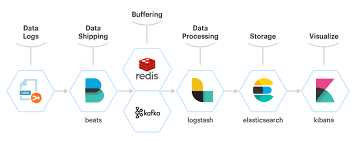
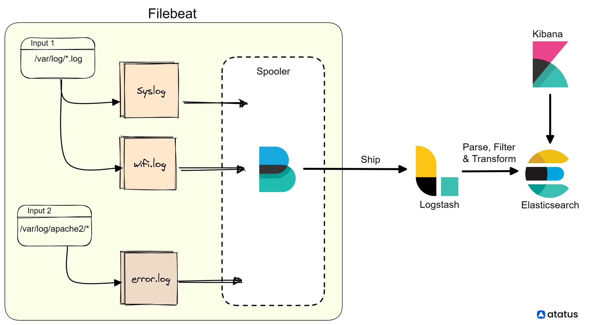

**ELK Stack** (elastic.co)

------

why we use elk?

- issue debugging
- performance analysis
- security analysis
- predictive analysis
- use to identify automation operation

type of data

- structured (Structured data have a special pattern, so they are stored according to certain principles and a process is performed on them)
- unstructured



##### install elasticsearch

```bash
rpm -ivh elastic-8.10.4-x86_64.rmp
```

> [!NOTE]
>
> After installation, it shows information about the user and password, as well as information about token creation and password recovery

------

##### install kibana

```bash
rpm -ivh kibana-8.10.4-x86_64.rpm
```

important path for configuration

- /etc/
- /var/lib/
- /var/log/
- /usr/share/

> [!IMPORTANT]
>
> In the configuration file of kibana (/etc/kibana/kibana.yml)
>
> Uncommenet **server.port**
>
> Set **server.host: "0.0.0.0"**

```bash
systemctl start kibana.service
systemctl enable kibana.service
systemctl status kibana.service
```

> [!WARNING]
>
> If the system RAM was low, we should increase the value of TimeoutStartSec in the /usr/lib/systemd/system/elasticsearch.service path

```bash
# health check elasticsearch command
curl -k -XGET -u elastic "my-password" https://localhost:9200
```

```bash
# open kibana in browser and then generate an enrollment for kibana
/usr/share/elasticsearch/bin/elastic-create-enrollment-token -s kibana
# copy and paste token to enrolment token for kibana browser
/usr/share/kibana/bin/kibana-verification-code
# get code and verrify your kibana
```

------

##### install filebeat

```bash
rpm -ivh filebeat-8.10.4-x86_64.rpm
```

Because Elastic Search works based on SSL, the modules that are connected to it also need a certificate. Kibana handles this automatically.

> [!NOTE]
>
> We temporarily disable 

`/etc/elasticsearch/elasticsearch.yml`

```yaml
xpac.security.http.ssl: # for clients such as Kibana, Logstash, etc
  enabled: false

xpac.security.transport.ssl: # for components for nodes
  enabled: false
```

`/etc/kibana/kibana.yml`

```bash
# change this line
elasticsearch.hosts: [http://...] # change https to http
elasticsearch.ssl.certificateAthurities # comment
elasticsearch.fleet.outputs #comment
```

------

`/etc/filebeat/filebeat.yml`

```yaml
filebeat.inputs:
  - type: filestream # type of input for collecting logs from file
	enable: true
	paths:
  	  - /root/logs/order-bulk.json
output.elasticsearch:
  hosts: ["localhost:9200"]
  username: "elasticsearch-user"
  passward: "elasticsearch-password"

```

```bash
systemctl start filebeat.service
systemctl enable filebeat.service
systemctl status filebeat.service
```

> [!NOTE]
>
> kibana browser `Menu > Management > Stack Management`
>
> In `Data > Index Management` , we manage indexes 
>
> In the `Data Stream` tab, it identifies the filebeat
>
> change `include hidden indices` state to show hidden indices
>
> In `Management > Stack Management > Data Views` , To see the indices, we must first create a Data View
>
> In `Menu > Analysis > Discover` we can see our data views

> [!WARNING]
>
> If we don't parse the data, it will dump all the data in the message field

‍‍‍‍‍In order to see the logs and monitor at a moment's notice, we must refer to ‍‍‍‍`Observability > Logs > Stream` 

‍‍‍‍

------

##### Install Logstash

`/var/lib/filebeat/registry`

It keeps the status of the files read by the filebeat , `rm -rf /var/lib/filebeat/*`

```bash
rpm -ivh logstash-8.10.4-x86_64.rpm
```

`/etc/logstash/`

```bash
/etc/logstash/logstash.yml # there is nothing to change
/etc/logstash/conf.d/ # default path to write piplines
/etc/logstash/pipelines.yml # path.config: "/etc/logstash/conf.d/*.conf"
```

```bash
nano beat.conf
input {
	beats {
		port => 5044
	}
}

filter {
	json {
		source => message
	}
	date {
		match => ["purchased_at", "ISO8601"]
		target => "@timestamp"
		timezone => "Asia/Tehran"
	}
}

output {
	elasticsearch {
		hosts => ["localhost:9200"]
        index => "hamid-%{+YYYY.MM.dd}"
        user => "elastic-user"
        password => "elastic-password"
	}
}
```

```bash
systemctl start logstash.service
systemctl enable logstash.service
systemctl status logstash.service
```

```tex
debug logstash -> /var/log/logstash
```

`/etc/filebeat/filebeat.yml`

```yaml
#comment
output.elasticsearch:
  ...
#uncomment   
output.logstash:
  hosts: ["localhost:5044"]
```

------



filebeat component:

- inputs
- harvester(is a process in background that watch your input file)

`/etc/filebeat/filebeat.yml`

```yaml
filebeat.inputs:
  - type: filestream
    enabled: true
    paths: # log file path
      - /var/log/*.log
    exclude_lines: ["^DBG"] # filter logs
    include_lines: ["^ERR","^WARN"] # filter logs
    exclue_files: [".gz$"] # don't read this files
    fields: # if we're gonna set module manually
      apache: true
```

`scanner option`

```yaml
close_renamed: closes files that are renamed or deleted while they are being monitored.
scan_frequency: specifies how ofen filebeat checks the directories for new files.
backoff: specifies the initial backoff time between scans, which increases exponentially with each subsequent scan failure.
max_backoff: specifies the maximum backoff time between scans.
spool_size: specifies the number of events to buffer before they are written to the output.
```

```yaml
filebeat.inputs:
  type: filestream
  paths:
    - /var/log/*
  prospector.sccaner.exclude_files: ['\.gz$'] #scanner don't read this files
  prospector.scanner.include_files: ['^/var/log/.'] #scanner read this files
  prospector.scanner.check_interval: 10s # filebeat check for new file
```

------

`/etc/elasticsearch/elasticsearch.yml`

```yaml
bootstrap.memory_lock: true # swap off
```

`/etc/elsaticsearch/jvm.options`

```tex
# elasticsearch resource option
```

`Kibana > Menu > Stack Management > Index Lifecycle Management > Edit Policy`

```tex
# for closing old indices harvester processes
```

##### Monitoring

`Menu > Mangment > Monitoring Stack`

You can monitor with two methods:

- Metric beat (In `integration` you can see the list of products that can integrate with metric. `example docker`)
- kibana stack

**when you enable a module on filebeat, you can't use paths for collecting  logs** 

```bash
sudo filebeat modules enable audit 
```

------

**Redis**

redis uses instead of spooler as queue.

`filebeat > spooler || filebeat > redis`

```bash
rpm -ivh redis
sysytemctl stop filebeat.service
systemctl stop logstash.service
```

`/etc/filebeat/filebeat.yml`

```yaml
output.elasticsearch: #comment
output.redis:
  hosts: ["localhost:6379"]
  key: filebeat #uniqe key for queue
  db: 0
  timeout: 5
```

`/etc/logstash/conf.d/beat.conf`

```tex
input {
	redis {
		host => "127.0.0.1"
		key => "filebeat"
		data_type => "list"
	}
}

filter {
	json {
		source => message
	}
	date {
		match => ["purchased_at", "ISO8601"]
		target => "@timestamp"
		timezone => "Asia/Tehran"
	}
}

output {
	elasticsearch {
		hosts => ["localhost:9200"]
        index => "hamid-%{+YYYY.MM.dd}"
        user => "elastic-user"
        password => "elastic-password"
	}
}
```

```bash
sysytemctl status redis.service
systemctl start filebeat.service
systemctl start logstash.service
```

------

**Grok**

`Management > Dev Tools > Grok Debugger`

```json
13:10:00.080 app1[3965987]: IN[1]PR[156481]ORD[46541]STR[544984]AV[5463213]SO[5464654]A[0]
%{DATA:time} %{DATA:driver}\[%{NUMBER:proc}\]: %{DATA:dir}\[%{NUMBER:msgtype}\]PR\[%{NUMBER:product}\]ORD\[%{NUMbER:order}\]%{GREEDYDATA:org-msg}

output:
{
	"time": "13:10:00.080",
    "driver": "app1",
    "proc": "3965987",
    "dir": "IN",
    "msgtype": "1",
    "product": "46541",
    "order": "46541",
	"org-msg": "STR[544984]AV[5463213]SO[5464654]A[0]"
}


%{DATA:time} %{DATA:driver}\[%{NUMBER:proc}\]: %{DATA:dir}%{GREEDYDATA:org-msg}
output:
{
	"time": "13:10:00.080",
    "driver": "app1",
    "proc": "3965987",
    "dir": "",
	"org-msg": "IN[1]PR[156481]ORD[46541]STR[544984]AV[5463213]SO[5464654]A[0]"
}
```

```bash
systemctl stop logstash.service
sysytemctl stop filebeat.service

/etc/logstash/conf.d/grok.conf

input {
	file {
		path => "/tmp/*.log"
		type => "log"
		start_position => "beginning"
		sincedb_path => "/dev/null"
	}
}

filter {
	grok {
		match => {"message" => "%{DATA:time} %{GREEDYDATA:org-msg}"}
		add_field {
			"dt" => "%{YYYY-MM-dd} %{time}"
		}
	}
	date {
		match => ["dt", "yyyy-MM-dd HH:mm:ss:SSS", "ISO8601"]
		target => "@timestamp"
		timezone => "Asia/Tehran"
	}
}

output {
	elasticsearch {
		hosts => ["localhost:9200"]
        	index => "hamid-%{+YYYY.MM.dd}"
        	user => "elastic-user"
        	password => "elastic-password"
	}
}
```

------

**shard**

`/etc/filebeat/filebeat.yml`

```yaml
setup.template.settings:
  index.number_of_shards: 1
```

`Stack Management > Index Management > Templates > Create template`

```json
# logistics
specify name of template
Add index to index_pattern that are supposed to use this template
-----------------------------------------------
# index settings (optional)

{
	"number_of_shards": 5,
    "number_of_replicas": 0
}
-----------------------------------------------
# mapping
Add field and specify the data type
dynamic template date
[
    {
        "strings_as_keywords": {
            "match_mapping_type": "string",
            "mapping": {
                "type": "keyword"
            }
        }
    }
]
-----------------------------------------------
aliases
```

`Stack Management > Index Lificycle Policies` (ILM)

3 phase:

- Hot
- Warm
- Cold

> [!IMPORTANT]
>
> To add a policy to an index:
>
> `Stack Management > Index Management > Choose index AND Manage Index Button > Add lificycle policy`

------

